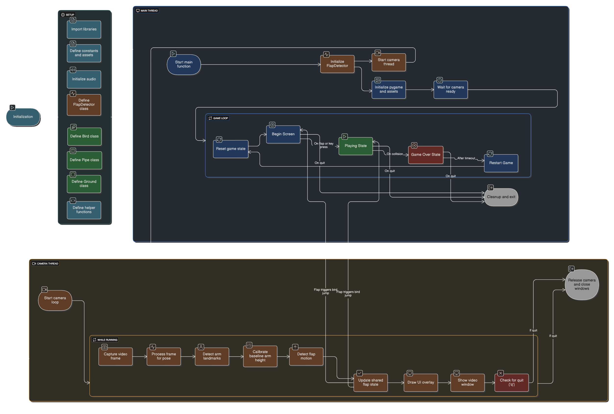

# Gesture-Controlled-Flappy-Bird

## Acknowledgements

This project builds upon [@LeonMarqs](https://github.com/LeonMarqs)'s repository: [Flappy-bird-python](https://github.com/LeonMarqs/Flappy-bird-python).  
It served as the foundation for the core game logic while I implemented gesture control as an experimental addition.

This project is purely educational and curiosity-driven, with no intention of commercial use.

